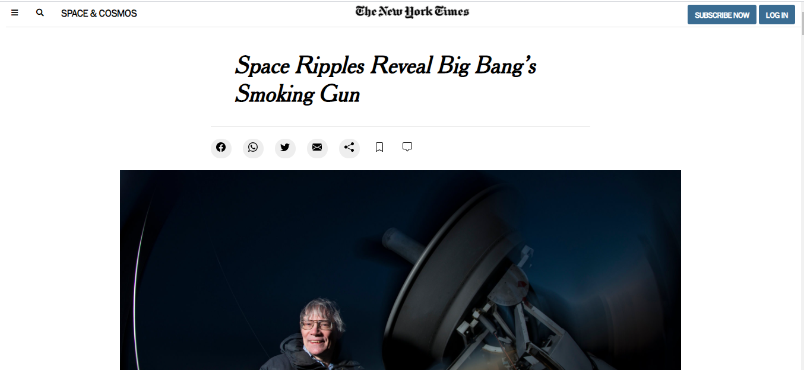

# Positioning and Floating Elements

> In this project I'm cloning a New York Times articles with all their characteristics.

I'm using HTML and CSS, I've used some HTML tags like header, section, div, button, h1, among others, and I've used some CSS properties like margin, padding, width, height, position and so on.

## Built With

- HTML
- CSS

## Live Demo

[Live Demo Link](https://holasoyedgar.github.io/NewYorkTimesClone/)

## Author

👤 **Edgar Rincon**

- GitHub: [@holasoyedgar](https://github.com/holasoyedgar)
- Twitter: [@holasoyedgar1](https://twitter.com/holasoyedgar1)
- LinkedIn: [LinkedIn](https://www.linkedin.com/in/edgar-rincon-serrano-3100481a0/)

## 🤝 Contributing

Contributions, issues, and feature requests are welcome!

Feel free to check the [issues page](issues/).

## Show your support

Give a ⭐️ if you like this project!

